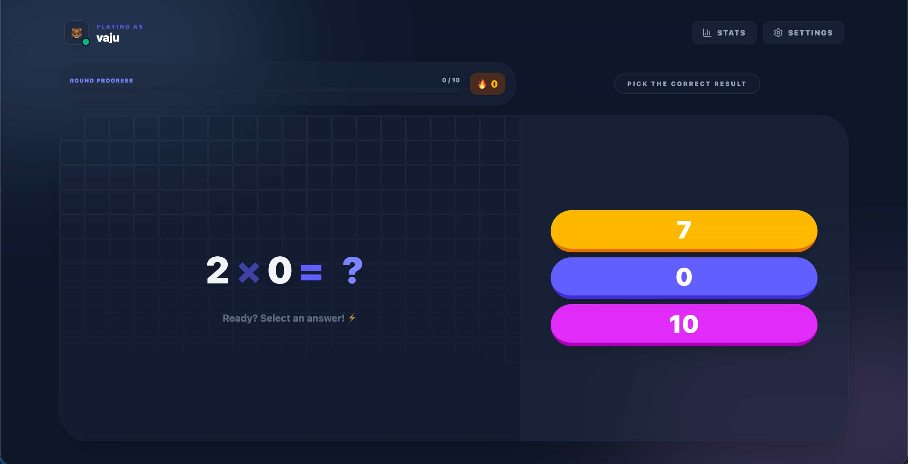
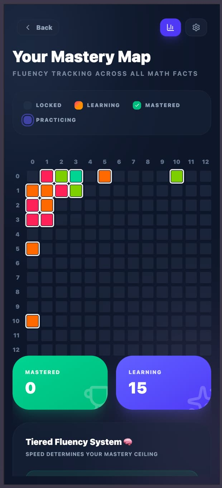
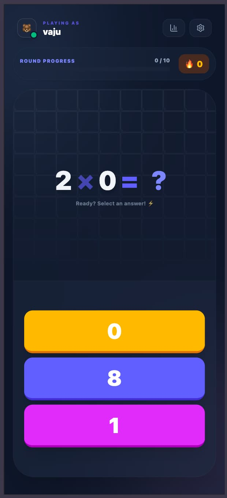

# 🎮 Multiplay 

Play here: [Multiplay](https://vajahath.github.io/multiplay/)

A smart, playful multiplication trainer designed to help kids move from counting to instant recall. Multiplay uses spaced repetition and adaptive learning to make practicing math feel more like a game and less like a chore.

## 🧠 How it Helps Kids Learn

Unlike simple quiz apps, Multiplay uses cognitive science principles to guide learners through the multiplication tables.

### ⚡ Tiered Fluency (Speed Matters)
Getting it right is just the first step. True mastery means instant recall.
- **Learning**: Identifying the fact.
- **Speed Building**: Getting faster at calculating.
- **Fluent Mastery**: Answering in under 3 seconds. The app tracks these speeds to ensure kids aren't just counting on their fingers.

### 📈 Adaptive Table Progression
We don't just go from 1 to 12. Multiplay introduces tables based on their pedagogical difficulty:
1. **The Patterns**: 1, 2, 3, 5, and 10 (The easiest to grasp).
2. **The Extensions**: 4 and 11.
3. **The Logical**: 9 (finger tricks) and 6 (extension of 3).
4. **The Challenge**: 7, 8, and 12.

**Smart Auto-Unlock**: When a child masters about 65% of their current tables, the system automatically introduces a new one, keeping the challenge just right.

### 🎯 Controlled Focus
To prevent frustration, the app manages exactly what the user sees:
- **Active Set**: We focus on just 15 facts at a time. Once one is "Mastered," a new one is rotated in.
- **Weighted Practice**: The app spends 60% of the time on the 5 facts the user finds hardest, ensuring they actually improve where it matters.

## ✨ Features
- **Modern Design**: Clean glassmorphism UI with vibrant colors.
- **Tactile Feedback**: Subtle haptic taps for correct answers and error signals.
- **Detailed Stats**: A visual heatmap showing exactly which facts are mastered and which need work.
- **Offline First**: Works anywhere, with progress saved locally in the browser.

## 🛠 Tech Stack
- **Svelte 5**: Responsive and reactive frontend.
- **Web Workers**: The learning engine runs in the background to keep things smooth.
- **IndexedDB**: Persistent local storage for user profiles and progress.

---
*Created with ❤️ by vaju & Antigravity.*
